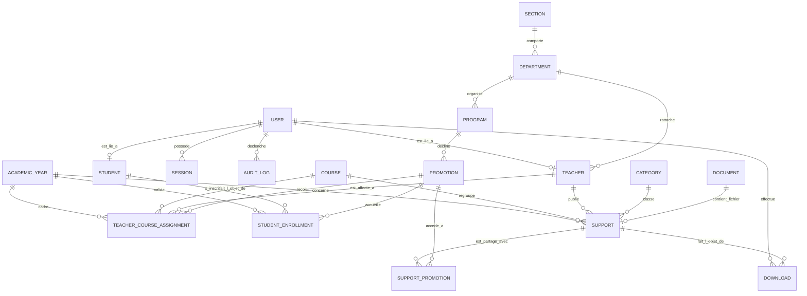

# Modèle de Domaine Métier Cible (UCB Bukavu)

## 1. Vision et Principes Fondamentaux

Le **Système de Gestion Pédagogique de l'Université Catholique de Bukavu (UCB)** repose sur un domaine académique et pédagogique fortement typé, normalisé et découplé des problématiques de présentation ou de stockage physique.

### Principes directeurs du Domaine :
1. **Un cours n'est pas un fichier :** Un `Course` (ex. *Programmation Web Avancée*) est une unité d'enseignement pérenne. Un `Support` est une ressource pédagogique versionnée rattachée à un cours.
2. **L'affectation lie les acteurs au cadre académique :** `TeacherCourseAssignment` établit précisément quel enseignant dispense quel cours, à quelle promotion, pour quelle année académique et quel semestre.
3. **Mutualisation des supports :** Un `Support` peut être partagé entre plusieurs promotions via l'association `SupportPromotion`.
4. **Sécurité et intégrité des documents :** Un fichier physique est modélisé par l'entité `Document` (clé de stockage opaque, somme de contrôle SHA-256, type MIME contrôlé, taille en octets), isolée du web root.
5. **Traçabilité totale :** Chaque consultation, téléchargement et modification est consignée dans `Download` et `AuditLog`.

---

## 2. Diagramme des Entités et Relations (ERD)

---

## 3. Spécification Détaillée des Entités

### 3.1. Structure Académique

#### `Section`
Représente une faculté ou école universitaire de l'UCB Bukavu.
- **Attributs :**
  - `id`: UUID (PK)
  - `code`: String (Unique, ex: `SCAI`, `FLA`, `SCIENCES_EXACTES`, `PSYCHO`)
  - `name`: String (ex: *Sciences Commerciales, Administratives et Informatique*)
  - `description`: String?
  - `createdAt`: Timestamp
  - `updatedAt`: Timestamp
- **Relations :** 1..N avec `Department`.

#### `Department`
Département d'enseignement rattaché à une section.
- **Attributs :**
  - `id`: UUID (PK)
  - `sectionId`: UUID (FK vers `Section`)
  - `code`: String (Unique, ex: `INFO_GESTION`, `COM_MARKETING`, `PEDAGOGIE_APP`)
  - `name`: String (ex: *Informatique de Gestion*)
  - `description`: String?
  - `createdAt`: Timestamp
  - `updatedAt`: Timestamp
- **Relations :** N..1 avec `Section`, 1..N avec `Program`, 1..N avec `Teacher`.

#### `Program`
Programme ou filière de formation (système LMD congolais).
- **Attributs :**
  - `id`: UUID (PK)
  - `departmentId`: UUID (FK vers `Department`)
  - `code`: String (ex: `LMD_INFO_GESTION`)
  - `name`: String (ex: *Licence en Informatique de Gestion*)
  - `cycle`: Enum (`LICENCE_LMD`, `MASTER_LMD`, `DOCTORAT`, `AGREGATION`)
  - `durationYears`: Int (ex: 3)
  - `createdAt`: Timestamp
  - `updatedAt`: Timestamp
- **Relations :** N..1 avec `Department`, 1..N avec `Promotion`, 1..N avec `Course`.

#### `Promotion`
Cohorte académique correspondant à une année d'étude d'un programme.
- **Attributs :**
  - `id`: UUID (PK)
  - `programId`: UUID (FK vers `Program`)
  - `code`: String (ex: `L1_IG`, `L2_IG`, `L3_IG`, `BAC1`, `BAC2`, `BAC3`)
  - `name`: String (ex: *Troisième Année Licence Informatique de Gestion (L3)*)
  - `academicLevel`: Int (1 pour L1, 2 pour L2, 3 pour L3)
  - `createdAt`: Timestamp
  - `updatedAt`: Timestamp
- **Relations :** N..1 avec `Program`, 1..N avec `StudentEnrollment`, 1..N avec `TeacherCourseAssignment`, N..N avec `Support` via `SupportPromotion`.

#### `AcademicYear`
Gestion explicite et ordonnée des années académiques.
- **Attributs :**
  - `id`: UUID (PK)
  - `code`: String (Unique, ex: `2024-2025`, `2025-2026`)
  - `startDate`: Date
  - `endDate`: Date
  - `isCurrent`: Boolean (Unicité : une seule année active à la fois)
  - `status`: Enum (`PLANNING`, `ACTIVE`, `CLOSED`, `ARCHIVED`)
  - `createdAt`: Timestamp
  - `updatedAt`: Timestamp
- **Règles métier :** La modification du statut `isCurrent = true` désactive automatiquement l'année précédente.

---

### 3.2. Pédagogie & Enseignement

#### `Course` (Unité d'Enseignement / Élément Constitutif)
Représente la matière académique enseignée.
- **Attributs :**
  - `id`: UUID (PK)
  - `programId`: UUID (FK vers `Program`)
  - `code`: String (Unique, ex: `INFO311`, `ALGO102`)
  - `title`: String (ex: *Algorithmique et Structures de Données*)
  - `credits`: Int (Crédits LMD ECTS, ex: 5)
  - `hoursTheory`: Int (Volume horaire Cours Magistral, CM)
  - `hoursTD`: Int (Volume Travaux Dirigés)
  - `hoursTP`: Int (Volume Travaux Pratiques)
  - `semester`: Enum (`S1`, `S2`, `S3`, `S4`, `S5`, `S6`)
  - `description`: String?
  - `createdAt`: Timestamp
  - `updatedAt`: Timestamp
- **Relations :** 1..N avec `Support`, 1..N avec `TeacherCourseAssignment`.

#### `TeacherCourseAssignment` (Charge Horaire / Affectation)
Affectation formelle d'un enseignant à un cours pour une promotion donnée.
- **Attributs :**
  - `id`: UUID (PK)
  - `teacherId`: UUID (FK vers `Teacher`)
  - `courseId`: UUID (FK vers `Course`)
  - `promotionId`: UUID (FK vers `Promotion`)
  - `academicYearId`: UUID (FK vers `AcademicYear`)
  - `roleInCourse`: Enum (`TITULAIRE`, `CO_TITULAIRE`, `ASSISTANT`, `CHARGE_DE_TP`)
  - `hourlyVolume`: Int
  - `status`: Enum (`PROPOSED`, `VALIDATED`, `COMPLETED`, `CANCELLED`)
  - `createdAt`: Timestamp
  - `updatedAt`: Timestamp
- **Contrainte d'unicité :** `(teacherId, courseId, promotionId, academicYearId, roleInCourse)` unique.

#### `Category`
Classification thématique ou typologique des ressources.
- **Attributs :**
  - `id`: UUID (PK)
  - `name`: String (Unique, ex: *Programmation*, *Modélisation*, *Pédagogie*, *Gestion*, *Réseaux*)
  - `description`: String?
  - `createdAt`: Timestamp
  - `updatedAt`: Timestamp
- **Relations :** 1..N avec `Support`.

#### `Support` (Ressource Pédagogique)
Ressource éducative diffusée aux étudiants.
- **Attributs :**
  - `id`: UUID (PK)
  - `courseId`: UUID (FK vers `Course`)
  - `categoryId`: UUID (FK vers `Category`)
  - `authorTeacherId`: UUID (FK vers `Teacher`)
  - `academicYearId`: UUID (FK vers `AcademicYear`)
  - `documentId`: UUID (FK unique vers `Document`)
  - `title`: String (ex: *Chapitre 2 : Arbres Bicolores et Algorithmes de Tri*)
  - `description`: Text?
  - `type`: Enum (`SYLLABUS`, `COURSE_SLIDES`, `TD`, `TP`, `EXAM_PAST_PAPER`, `CORRECTION`, `COMPLEMENTARY_READING`)
  - `status`: Enum (`DRAFT`, `PUBLISHED`, `ARCHIVED`)
  - `version`: Int (Défaut : 1)
  - `publishedAt`: Timestamp?
  - `downloadCount`: Int (Dénormalisé pour performance de tri, défaut: 0)
  - `createdAt`: Timestamp
  - `updatedAt`: Timestamp
- **Relations :** 1..N avec `SupportPromotion`, 1..N avec `Download`.

#### `SupportPromotion`
Table de liaison many-to-many autorisant l'accès d'un support à une ou plusieurs promotions.
- **Attributs :**
  - `id`: UUID (PK)
  - `supportId`: UUID (FK vers `Support`)
  - `promotionId`: UUID (FK vers `Promotion`)
  - `createdAt`: Timestamp
- **Contrainte d'unicité :** `(supportId, promotionId)` unique.

---

### 3.3. Acteurs & Personnes

#### `Teacher`
Enseignant rattaché à l'Université Catholique de Bukavu (UCB).
- **Attributs :**
  - `id`: UUID (PK)
  - `userId`: UUID (FK unique vers `User`)
  - `departmentId`: UUID (FK vers `Department`)
  - `matricule`: String (Unique)
  - `firstName`: String
  - `lastName`: String
  - `gender`: Enum (`M`, `F`)
  - `academicTitle`: Enum (`PROFESSEUR_ORDINAIRE`, `PROFESSEUR`, `PROFESSEUR_ASSOCIE`, `CHEF_DE_TRAVAUX`, `ASSISTANT_2`, `ASSISTANT_1`)
  - `qualificationLevel`: String (ex: *Doctorat*, *Master 2*, *DEA*, *Ingénieur*)
  - `specialty`: String (ex: *Génie Logiciel*, *Réseaux*, *Intelligence Artificielle*)
  - `phone`: String?
  - `bio`: Text?
  - `createdAt`: Timestamp
  - `updatedAt`: Timestamp

#### `Student`
Étudiant inscrit à l'Université Catholique de Bukavu (UCB).
- **Attributs :**
  - `id`: UUID (PK)
  - `userId`: UUID (FK unique vers `User`)
  - `matricule`: String (Unique, ex: `9898/2122`)
  - `firstName`: String
  - `lastName`: String
  - `gender`: Enum (`M`, `F`)
  - `birthDate`: Date?
  - `phone`: String?
  - `createdAt`: Timestamp
  - `updatedAt`: Timestamp

#### `StudentEnrollment` (Inscription Académique Annuelle)
Historique d'inscription d'un étudiant par promotion et année.
- **Attributs :**
  - `id`: UUID (PK)
  - `studentId`: UUID (FK vers `Student`)
  - `promotionId`: UUID (FK vers `Promotion`)
  - `academicYearId`: UUID (FK vers `AcademicYear`)
  - `status`: Enum (`ENROLLED`, `REPEATING`, `ABANDONED`, `GRADUATED`)
  - `enrolledAt`: Timestamp
- **Contrainte d'unicité :** `(studentId, academicYearId)` unique (un étudiant ne peut être inscrit que dans une promotion par année académique).

---

### 3.4. Sécurité, Fichiers, Traçabilité

#### `User`
Compte d'accès système.
- **Attributs :**
  - `id`: UUID (PK)
  - `email`: String (Unique)
  - `username`: String (Unique, souvent le matricule)
  - `passwordHash`: String (Argon2id)
  - `role`: Enum (`SUPER_ADMIN`, `ACADEMIC_ADMIN`, `PEDAGOGICAL_MANAGER`, `TEACHER`, `STUDENT`)
  - `status`: Enum (`ACTIVE`, `PENDING_ACTIVATION`, `SUSPENDED`, `DEACTIVATED`)
  - `avatarDocumentId`: UUID? (FK vers `Document`)
  - `lastLoginAt`: Timestamp?
  - `createdAt`: Timestamp
  - `updatedAt`: Timestamp

#### `Session`
Session active côté serveur (remplaçant les sessions PHP fichiers).
- **Attributs :**
  - `id`: UUID (PK)
  - `userId`: UUID (FK vers `User`)
  - `sessionTokenHash`: String (Unique, SHA-256 du cookie token)
  - `ipAddress`: String
  - `userAgent`: String
  - `expiresAt`: Timestamp
  - `revokedAt`: Timestamp?
  - `createdAt`: Timestamp

#### `Document`
Métadonnées du fichier physique stocké en zone sécurisée.
- **Attributs :**
  - `id`: UUID (PK)
  - `storageKey`: String (Unique, UUID aléatoire sur disque ou S3)
  - `originalFileName`: String (ex: *Cours_Algorithmique_L1.pdf*)
  - `mimeType`: String (ex: *application/pdf*)
  - `extension`: String (ex: *pdf*)
  - `fileSize`: BigInt (taille en octets)
  - `sha256`: String (Empreinte cryptographique pour intégrité et déduplication)
  - `storageDriver`: Enum (`LOCAL_PRIVATE`, `S3_COMPATIBLE`)
  - `createdAt`: Timestamp

#### `Download`
Journalisation et statistiques des téléchargements de supports.
- **Attributs :**
  - `id`: UUID (PK)
  - `supportId`: UUID (FK vers `Support`)
  - `userId`: UUID (FK vers `User`)
  - `studentId`: UUID? (FK vers `Student`)
  - `ipAddress`: String
  - `userAgent`: String
  - `feedbackComment`: Text?
  - `downloadedAt`: Timestamp

#### `AuditLog`
Piste d'audit de sécurité et gouvernance.
- **Attributs :**
  - `id`: UUID (PK)
  - `actorUserId`: UUID? (FK vers `User`)
  - `action`: String (ex: `USER_LOGIN`, `SUPPORT_PUBLISHED`, `USER_ROLE_CHANGED`, `SUPPORT_DELETED`)
  - `resource`: String (ex: `Support`, `User`, `Assignment`)
  - `resourceId`: String
  - `payload`: JSON? (anciennes/nouvelles valeurs, hors secrets)
  - `ipAddress`: String
  - `requestId`: String
  - `timestamp`: Timestamp

---

## 4. Règles Métier et Invariants Clés

1. **Règle d'accès aux supports pour l'étudiant :**  
   Un étudiant $S$ inscrit dans la promotion $P$ pour l'année académique active $A$ peut consulter et télécharger le support $R$ si et seulement si :
   - $R.status = \text{PUBLISHED}$
   - Il existe une liaison $R \leftrightarrow P$ dans `SupportPromotion`
2. **Règle de publication pour l'enseignant :**  
   Un enseignant $T$ ne peut publier un support pour un cours $C$ et une promotion $P$ que s'il dispose d'une affectation active validée (`TeacherCourseAssignment`) sur ce cours et cette promotion, ou s'il dispose du rôle `PEDAGOGICAL_MANAGER` ou supérieur.
3. **Immutabilité des audits et téléchargements :**  
   Les tables `AuditLog` et `Download` sont en écriture seule (append-only) ; aucune mise à jour ni suppression n'est permise.
4. **Intégrité des fichiers :**  
   Tout fichier entrant subit le pipeline de hachage SHA-256 et d'inspection Magic Bytes. Si le hash correspond à un document déjà stocké, le document existant est réutilisé (déduplication transparente).
