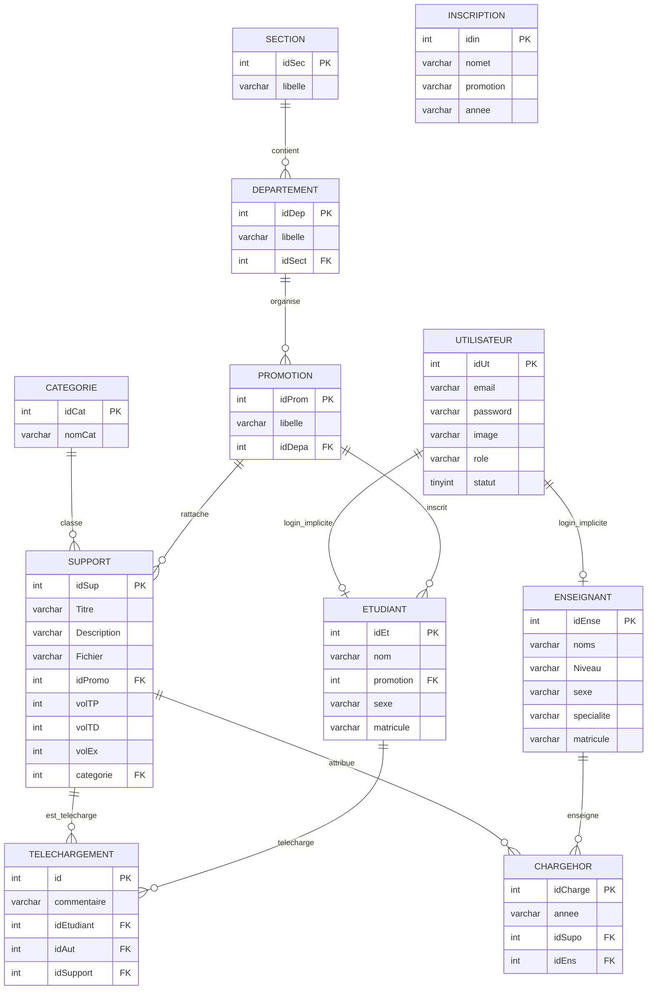

# Analyse Approfondie du Système Hérité (support-pedagogique)
**Établissement cible :** Université Catholique de Bukavu (UCB)  
**Auteurs initiaux du projet hérité :** Irs Prince Abibu, Yoshua Ayamba, Zigashane Balungwe, Sara Rwema  
**Contexte initial déduit :** Projet académique en Informatique, basé sur la base de données `sarahbdd` / `projet`.

---

## 1. Contexte & Historique de la Base de Code

L'inspection exhaustive du dépôt révèle que le système d'origine a été conçu comme un projet PHP/MySQL destiné à gérer le partage des supports de cours au département d'Informatique.

Cependant, l'analyse des artefacts révèle que ce projet a été construit par dérivation et modification d'un ancien template ou projet de microfinance/prêt (nom du dossier source : `PROJETPRETFIN` pour "Projet Prêt Finance", présence d'un fichier `FORMULAIRE DEMANDE DE CREDIT.docx` dans les supports, et résidus de code tels que le contrôle de rôle `$_SESSION['user']['role'] != 'Bailleur'` dans `mon_role.php`). 

Par la suite, un template d'administration Bootstrap/Spike Dashboard a été intégré avec des formulaires modaux et des scripts PHP procéduraux dédiés à chaque entité.

---

## 2. Inventaire et Fonctionnalités Réellement Implémentées

| Domaine | Fichiers impliqués | Fonctionnalités réelles constatées |
| :--- | :--- | :--- |
| **Portail Public** | `index.php`, `style.css` | Page d'accueil avec en-tête UCB Bukavu / ESU et trois portes d'entrée : Faculté, Étudiants, Enseignants. Liens statiques d'information et boîte à suggestion. |
| **Authentification à 2 étapes (Département)** | `connection/connectdepartement.php`, `connection/connectetudiantbac1.php`, `connection/connectenseignant.php` | Formulaire intermédiaire vérifiant l'appartenance académique (nom + matricule ou nom de département + code) avant de rediriger vers les formulaires d'authentification utilisateur. |
| **Authentification & Session** | `connectionUser.php`, `connectionUserDep.php`, `connectionUserEnse.php`, `login.php`, `ma_session.php`, `mon_role.php`, `seDeconnecter.php` | Connexion utilisateur vérifiant `email` (ou `matricule`), `password` (en clair) et `statut = 1`. Création de session `$_SESSION['user']`. Déconnexion via destruction de session. |
| **Tableau de Bord** | `dashboard.php` | Affichage du profil utilisateur connecté et de 3 indicateurs globaux : Nombre total d'enseignants (`COUNT(*) from enseignant`), d'étudiants (`COUNT(*) from etudiant`), et de supports (`COUNT(*) from support`). Menu latéral adaptant l'affichage selon le rôle. |
| **Supports Pédagogiques** | `supports.php`, `insertSupport.php`, `modSupport.php`, `supSupport.php`, `envoie1.php` | Consultation des supports sous forme de tableau. Recherche par titre (`LIKE '%$Titre%'`). Filtrage conditionnel selon rôle (les étudiants sont restreints via `idEt = $id`). Ajout d'un support avec upload de fichier. Modification des métadonnées. Remplacement de syllabus via `envoie1.php`. Suppression par ID. |
| **Téléchargement** | `telecharger.php`, `insertTelechargement.php` | Téléchargement de fichier via en-têtes HTTP ou lien direct `<a>`. Enregistrement d'un journal de téléchargement dans la table `telechargement` (`idSupport`, `idAut`, `idEtudiant`, `commentaire`). |
| **Structure Académique** | `section.php`, `departement.php`, `promotion.php` (+ `insert*.php`, `mod*.php`, `sup*.php`) | CRUD complet des sections (SCAI, FLA, Sciences exactes, Psycho), des départements rattachés à une section, et des promotions rattachées à un département. |
| **Gestion des Enseignants** | `enseignants.php`, `insertEnseignant.php`, `modEnseignant.php`, `supEnseignant.php` | CRUD des enseignants (noms, niveau académique, spécialité, sexe, matricule, photo). Génération automatique et non-synchronisée d'un compte utilisateur associé avec mot de passe = matricule. |
| **Gestion des Étudiants** | `etudiants.php`, `insertEtudiant.php`, `modEtudiant.php`, `supEtudiant.php` | CRUD des étudiants (nom, promotion, sexe, matricule, photo). Création automatique d'un compte utilisateur avec mot de passe = matricule. |
| **Inscriptions Annuelles** | `inscription.php`, `modinscription.php` | Enregistrement d'une inscription annuelle associant un nom d'étudiant, une promotion et une année académique (chaînes brutes). |
| **Affectations (Charges Horaires)** | `affectation.php`, `affectation2.php`, `insertAffectation.php`, `modAffectation.php`, `supCharge.php` | Association entre une année, un support (faisant office de cours) et un enseignant. `affectation2.php` sert de vue de consultation pour les enseignants. |
| **Catégories Pédagogiques** | `categories.php`, `insertCategorie.php`, `modCategorie.php`, `supCategorie.php` | CRUD des catégories de supports (ex. Programmation, Modélisation, Pédagogique, Cours de gestion). |
| **Gestion des Utilisateurs** | `utilisateurs.php`, `insertUtilisateur.php`, `modUtilisateur.php`, `activer.php` | Liste des utilisateurs, activation/désactivation de compte (`activer.php`), modification manuelle de profil. |
| **Recherche & Brouillons** | `search.php`, `intEt.php`, `connection/envoiesyllabus.php` | Scripts expérimentaux ou inachevés pour la recherche, l'interface étudiant dédiée et la liaison de cours LMD (bac1 avec crédits et intitulé). |

---

## 3. Entités Métier et Schéma Déduits du Dépôt

L'inspection de `projet.sql` et des requêtes SQL dispersées met en évidence les tables suivantes :



---

## 4. Rôles et Modèle de Contrôle d'Accès Réel

Dans la base de données (`utilisateur.role`), les valeurs trouvées sont :
1. `Administrateur` : accès complet aux menus CRUD (étudiants, enseignants, promotions, sections, catégories, affectations, inscriptions, utilisateurs).
2. `Enseignant` : accès à `dashboard.php`, `supports.php`, `affectation2.php`.
3. `Etudiant` : accès à `dashboard.php` et `supports.php`.
4. Résidus historiques inactifs : `'Bailleur'` et `'Adminstrateur'` (dans `mon_role.php`).

### Défaillance Majeure du Contrôle d'Accès
- **Sécurité d'affichage uniquement :** Le contrôle de rôle n'est fait que dans le menu latéral (`if ($role == "Administrateur") { ... }`).
- **Aucune garde sur les endpoints d'action :**
  - Un étudiant non connecté ou anonyme peut exécuter directement :
    - `GET /supSupport.php?idSup=14` -> Suppression immédiate du support !
    - `GET /supEtudiant.php?idEt=1` -> Suppression d'un étudiant !
    - `GET /activer.php?idUt=463` -> Bascule d'activation d'un compte admin !
  - Aucune vérification de session n'est incluse dans les scripts `insert*.php`, `mod*.php`, `sup*.php` !
  - Dans `mon_role.php`, la condition logique `if($_SESSION['user']['role']!='Adminstrateur' or $_SESSION['user']['role']!='Bailleur')` est un paradoxe logique qui s'évalue toujours à `true`.

---

## 5. Association des Supports, Étudiants et Enseignants

### A. Supports & Promotions
Dans `support`, chaque document possède une clé étrangère unique `idPromo`.
- **Limitation conceptuelle :** Un même document pédagogique (ex: *Algorithmique Générale*, *Anglais Technique*, ou *Méthodologie de Recherche*) ne peut être lié qu'à une seule promotion. Si 3 promotions suivent le même cours, le fichier devait être téléversé 3 fois.

### B. Association Étudiant -> Support
Dans `supports.php`, le filtrage étudiant est codé comme suit :
```sql
SELECT * from support 
inner join promotion on support.idPromo=promotion.idProm
inner join etudiant on etudiant.promotion=promotion.idProm
inner join categorie on support.categorie=categorie.idCat 
where idEt=$id
```
- Le script suppose que l'identifiant de session utilisateur `$id` (`idUt`) est strictement égal à l'identifiant étudiant `idEt` (`where idEt=$id`).
- Dès qu'un utilisateur a été créé avec un `idUt` différent (généré par `mt_rand()` ou auto-incrémentation non alignée), l'étudiant ne voit aucun support !

### C. Conflit Conceptuel Majeur : Support vs Cours vs Charge Horaire
Dans le système hérité, l'entité `Course` (Cours) n'existe pas.
La table `chargehor` (affectation) lie `idEns` (enseignant) avec `idSupo` (support).
Par conséquent :
- Le cours est confondu avec un fichier de support.
- Si un enseignant dépose 5 chapitres pour son cours, le système oblige à créer 5 affectations distinctes dans `chargehor`.
- Le lien vers la promotion et la matière est fragmenté et inconsistant.

---

## 6. Analyse du Pipeline d'Upload et de Téléchargement

### A. Flux d'Upload Hérité
```
Navigateur 
  → Formulaire multipart (POST) 
  → move_uploaded_file($fichier_tmp, 'fichiers/supportFiles/'.$fichier) 
  → INSERT INTO support VALUES (NULL, ..., $fichier, ...)
```
**Vulnérabilités critiques :**
1. **Nom d'origine conservé tel quel :** Les noms de fichiers avec caractères spéciaux, espaces (`Cours d'entrepreneuriat L3 IG (1).pdf`) ou chemins relatifs (`../../../shell.php`) sont écrits tels quels sur le disque.
2. **Absence de validation de type :** Aucune vérification de l'extension, aucun contrôle du type MIME réel, aucun examen des octets magiques (*magic bytes*). N'importe quel fichier exécutable (`.php`, `.phtml`, `.exe`) peut être envoyé.
3. **Répertoire public direct :** Le dossier `fichiers/supportFiles/` est situé dans le répertoire web public Apache. Un fichier `.php` téléversé est immédiatement exécutable via une simple requête HTTP GET `http://localhost/.../fichiers/supportFiles/malicieux.php` (Exécution de Code à Distance / RCE totale).

### B. Flux de Téléchargement Hérité
- Dans le tableau des supports (`supports.php`) :
  ```html
  <a href="fichiers/supportFiles/<?= $support['Fichier']; ?>" download="..."><i class="fa fa-download"></i></a>
  ```
  Le téléchargement contourne complètement le script de téléchargement et fournit un lien direct vers le fichier public.
- Dans le script `telecharger.php` :
  - Tentative d'utiliser à la fois l'API PDO et l'ancienne extension dépréciée `mysql_fetch_assoc($requete)`.
  - En-têtes HTTP envoyés sans sanitisation :
    ```php
    header("Content-Disposition:attachment; filename=".$valeur['Fichier']);
    readfile("fichiers/supportFiles/".$valeur['Fichier']);
    ```
  - Traçage dans la table `telechargement` avec des identifiants non vérifiés.

---

## 7. Inventaire des Failles de Sécurité et Faiblesses Techniques

| Catégorie | Faille / Faiblesse identifiée | Localisation / Exemple | Gravité |
| :--- | :--- | :--- | :--- |
| **Authentification** | Mots de passe stockés en clair | `utilisateur.password`, `login.php`, `fonctions.php` | **CRITIQUE** |
| **Authentification** | Mot de passe par défaut égal au matricule | `insertEtudiant.php`, `insertEnseignant.php` | **ÉLEVÉE** |
| **Injection SQL** | Concaténation de variables dans les requêtes SQL | `connection/connectdepartement.php` line 23, `connectenseignant.php` line 23, `modinscription.php` line 11, `activer.php` line 5, `dashboard.php` line 16 | **CRITIQUE** |
| **RCE (Upload)** | Upload sans filtrage d'extension ni contrôle MIME vers dossier public | `insertSupport.php`, `envoie1.php`, `insertEtudiant.php`, `modSupport.php` | **CRITIQUE** |
| **IDOR / Absence RBAC** | Suppression et modification de données sans authentification | `supSupport.php`, `supEtudiant.php`, `supEnseignant.php`, `activer.php` | **CRITIQUE** |
| **Fuite de données** | Répertoire de fichiers sensible directement accessible par URL | Dossier web `fichiers/supportFiles/*` sans `.htaccess` ni restriction | **CRITIQUE** |
| **Logique Corrompue** | Décalage des colonnes lors de la mise à jour des supports | `modSupport.php` : l'ordre des paramètres mélange `$promotion`, `$dateCre`, `$datePub`, `$motCle` avec `volTP`, `volTD`, `volEx`, `idPromo` | **ÉLEVÉE** |
| **Élévation de Privilège** | Modification forcée du rôle à "Administrateur" | `modUtilisateur.php` ligne 8 : `$role = "Administrateur";` en dur | **CRITIQUE** |
| **Incohérence Modèle** | Séparation artificielle entre `etudiant` et `inscription` | `etudiant` stocke `promotion` (int), tandis que `inscription` stocke `promotion` (string) et `nomet` (string) | **MOYENNE** |
| **Erreurs PHP & Obsolescence** | Mélange PDO et fonctions dépréciées `mysql_*`, redirection HTTP après envoi de texte HTML/script | `telecharger.php`, `envoie1.php`, `modinscription.php` | **ÉLEVÉE** |

---

## 8. Tri des Fonctionnalités : Conserver, Transformer, Abandonner

### A. Ce qui est Conservé (Valeur Métier Intactée)
1. **Périmètre académique UCB Bukavu :** Facultés (ex: FST), Départements (ex: Sciences Informatiques), Promotions (BAC1, BAC2, BAC3 / L1, L2, L3 LMD).
2. **Gestion des Enseignants :** Nom, Niveau académique (Doctorat, Master, DEA, etc.), Spécialité, Matricule, Sexe.
3. **Gestion des Étudiants :** Matricule académique, Nom complet, Sexe, Photo de profil.
4. **Catégorisation des Ressources :** Organisation thématique des cours (Programmation, Modélisation, Pédagogie, Gestion, etc.).
5. **Distribution des Supports aux Étudiants :** Un étudiant accède aux cours et supports relatifs à sa promotion et son parcours.
6. **Statistiques de Téléchargement et d'Audience :** Mesure des téléchargements et de l'intérêt pédagogique des ressources.

### B. Ce qui est Transformé (Refonte Métier Nécessaire)
1. **Séparation nette `Course` vs `Support` :** Un cours existe en tant que matière académique structurée (ex. *Algorithmique et Structures de Données*, 45h, 5 crédits LMD). Un support est une ressource attachée à ce cours (Syllabus, TD, TP, Examen, Corrigé).
2. **Relation `Support` <---> `Promotion` (Many-to-Many) :** Un même support peut être mutualisé entre plusieurs promotions sans duplication physique de fichier.
3. **Entité `AcademicYear` autonome :** Gestion des années académiques (2024-2025, 2025-2026) avec statut active/fermée, au lieu de chaînes de caractères dispersées.
4. **Entité `TeacherCourseAssignment` (Affectation Pédagogique) :** Formalisation explicite : quel enseignant dispense quel cours, à quelle promotion, pour quelle année académique et quel semestre.
5. **Pipeline de Stockage Privé :** Stockage sécurisé hors du web root, hachage SHA-256, validation de l'extension et des magic bytes, téléchargement contrôlé par streaming authentifié.
6. **Contrôle d'Accès RBAC Strict Côté Serveur :** Guards NestJS vérifiant les permissions sur chaque route API REST.
7. **Authentification Moderne :** Hachage Argon2id, sessions serveur avec cookies `HttpOnly` / `Secure` / `SameSite=Strict`.

### C. Ce qui est Abandonné Définitivement (Obsolète / Nuisible)
1. Tout le code procédural PHP avec requêtes SQL en texte brut sans validation.
2. Le stockage des mots de passe en texte clair.
3. L'upload direct dans des répertoires publics Apache.
4. Les redirections HTML `<meta http-equiv="refresh">` et `echo "<script>alert()</script>"`.
5. Les scripts individuels `insert*.php`, `mod*.php`, `sup*.php` sans session ni contrôle.
6. Les résidus de projets étrangers (rôles 'Bailleur', formulaires de demande de crédit).
7. Le mélange des concepts où l'enseignant est lié directement au fichier au lieu du cours.

---

## 9. Synthèse des Données Existantes à Migrer

D'après le dump `projet.sql` et le système de fichiers :
- **Sections existantes :** 4 sections (SCAI, FLA, Sciences exactes, PSYCHO).
- **Départements existants :** 1 département documenté (INFORMATIQUE DE GESTION), rattaché à SCAI.
- **Promotions existantes :** 6 promotions (BAC1, BAC2, BAC3 sous divers départements).
- **Enseignants existants :** 3 enseignants identifiés (Mbilizi, Akilimali Pascal, Kyenda).
- **Étudiants existants :** 9 étudiants enregistrés avec matricule (Cokola Blanche, Sara Rwema, Prince Abibu, Zigashane Balungwe, Yoshua Ayamba, Kiribata, Huruma, Kapumi, Sophie).
- **Supports existants :** 6 enregistrements de supports dans la base (`Animaux totalement protégés en RDC`, `POO`, `CODE WEB`, `ORDINATEUR 2 générations`, `RECHERCHE`, `pédagogie générale`).
- **Fichiers physiques réels :** 24 fichiers dans `fichiers/supportFiles/` et 25 photos dans `fichiers/imagesUt/`.
- **Stratégie de migration requise :** Un script d'ingestion et de normalisation doit convertir ces données, hasher les mots de passe avec Argon2id, recalculer les empreintes SHA-256 des fichiers et les déplacer dans un stockage privé sécurisé.
